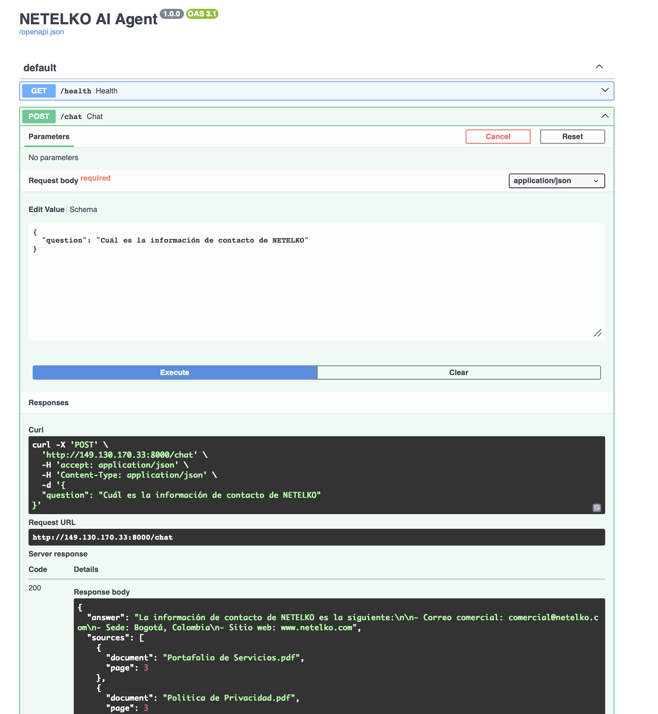

# NETELKO AI Agent

## Descripción general

# 🤖 NETELKO AI Agent

Agente de Inteligencia Artificial desarrollado en Python utilizando **LangChain**, **Ollama**, **ChromaDB** y **FastAPI** para responder preguntas basadas en documentos corporativos mediante la técnica **Retrieval-Augmented Generation (RAG)**.

El proyecto fue diseñado para ejecutarse localmente y desplegarse en **Oracle Cloud Infrastructure (OCI)** utilizando Docker.

---

# Arquitectura

```
                Usuario
                    │
                    ▼
              FastAPI REST API
                    │
                    ▼
          Text Normalizer (Utils)
                    │
                    ▼
             Chroma Retriever
                    │
                    ▼
             LangChain RAG
                    │
                    ▼
           Ollama (Qwen2.5 7B)
                    │
                    ▼
               Respuesta
```

---

# Tecnologías

- Python 3.11
- FastAPI
- LangChain
- Ollama
- ChromaDB
- HuggingFace Embeddings
- Docker
- Oracle Cloud Infrastructure
- Oracle Container Registry (OCIR)

---

# Características

- RAG (Retrieval Augmented Generation)
- API REST con FastAPI
- Swagger UI
- Chroma Vector Database
- Embeddings con HuggingFace
- LLM local mediante Ollama
- Dockerizado
- Despliegue en Oracle Cloud
- Respuestas con referencia al documento y página utilizada

---

# Estructura del proyecto

```
app/
│
├── api/
│     └── main.py
│
├── models/
│
├── services/
│
├── utils/
│     └── text.py
│
├── embeddings.py
├── llm.py
├── rag_chain.py
├── retriever.py
├── splitter.py
├── vectorstore.py
│
└── scripts/
      └── ingest.py

data/
    └── documents/

chroma_db/

Dockerfile

requirements.txt
```

---

# Instalación

## Clonar repositorio

```bash
git clone https://github.com/Netelko/netelko-ai-agent.git

cd netelko-ai-agent
```

---

## Crear entorno virtual

```bash
python -m venv .venv
```

Linux / Mac

```bash
source .venv/bin/activate
```

Windows

```powershell
.venv\Scripts\activate
```

---

## Instalar dependencias

```bash
pip install -r requirements.txt
```

---

# Instalar Ollama

https://ollama.com

Descargar el modelo:

```bash
ollama pull qwen2.5:7b
```

---

# Variables de entorno

Crear archivo

```
.env
```

Ejemplo

```env
OLLAMA_URL=http://localhost:11434

LLM_PROVIDER=ollama

LLM_MODEL=qwen2.5:7b

EMBEDDING_MODEL=BAAI/bge-m3

CHROMA_DB=chroma_db

DOCUMENTS_PATH=data/documents
```

---

# Ingestar documentos

Colocar los documentos PDF dentro de:

```
data/documents
```

Ejecutar

```bash
python app/scripts/ingest.py
```

Esto genera la base vectorial:

```
chroma_db/
```

---

# Ejecutar la API

```bash
uvicorn app.api.main:app --reload
```

Abrir

```
http://localhost:8000/docs
```

---

# Endpoints

## Health

GET

```
/health
```

Respuesta

```json
{
    "status":"ok"
}
```

---

## Chat

POST

```
/chat
```

Body

```json
{
    "question":"¿Qué servicios ofrece NETELKO?"
}
```

Respuesta

```json
{
  "answer":"NETELKO ofrece...",
  "sources":[
    {
      "document":"Portafolio de Servicios.pdf",
      "page":2
    }
  ]
}
```

---

## Ingest

POST

```
/ingest
```

Reconstruye la base vectorial utilizando los documentos del directorio.

---

# Docker

Construir imagen

```bash
docker build --platform linux/amd64 -t agenteainetelko-api .
```

Ejecutar

```bash
docker run -d \
    --name netelko-ai-agent \
    --network host \
    agenteainetelko-api
```

---

# Despliegue en Oracle Cloud

## Publicar imagen en OCIR

```bash
docker tag agenteainetelko-api \
ocir.sa-bogota-1.oci.oraclecloud.com/<namespace>/netelko-ia-agente:latest
```

```bash
docker push \
ocir.sa-bogota-1.oci.oraclecloud.com/<namespace>/netelko-ia-agente:latest
```

---

## Descargar imagen en la VM

```bash
docker pull \
ocir.sa-bogota-1.oci.oraclecloud.com/<namespace>/netelko-ia-agente:latest
```

---

## Ejecutar

```bash
docker run -d \
    --restart unless-stopped \
    --network host \
    --name netelko-ai-agent \
    -e OLLAMA_URL=http://127.0.0.1:11434 \
    ocir.sa-bogota-1.oci.oraclecloud.com/<namespace>/netelko-ia-agente:latest
```

---

# Flujo del sistema

```
Usuario
    │
    ▼
Pregunta
    │
    ▼
Normalización
    │
    ▼
Retriever
    │
    ▼
ChromaDB
    │
    ▼
Contexto
    │
    ▼
Prompt
    │
    ▼
Ollama
    │
    ▼
Respuesta
```

---

# Próximas mejoras

- Streaming de respuestas
- Historial de conversación
- Re-ranking de documentos
- Soporte para DOCX y CSV
- Memoria conversacional
- Caché de respuestas frecuentes
- Panel web tipo ChatGPT
- Autenticación mediante JWT
- Despliegue automatizado con GitHub Actions
- Monitoreo y métricas

---

# Autor

**Netelko**

Proyecto desarrollado como una implementación de un agente de IA basado en RAG utilizando tecnologías open source y desplegado sobre Oracle Cloud Infrastructure.

---

# Licencia

MIT License




---
Repositorio con el deploy en OCI

http://149.130.170.33:8000/docs#/default/chat_chat_post

